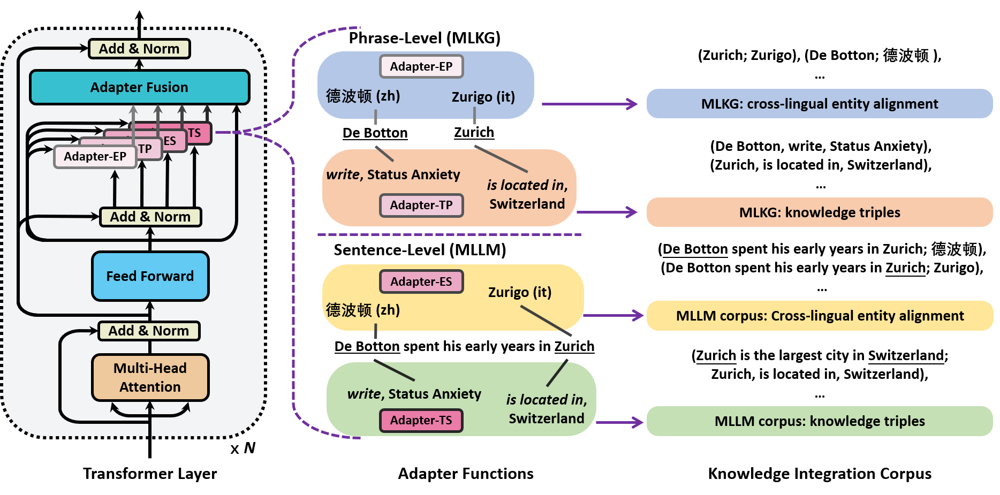

## Knowledge Adapter Set for Multilingual Language Model Enhancement

[](https://arxiv.org/abs/2210.13617)
[](https://adapterhub.ml/explore/#:~:text=Multilingual%20Knowledge%20Integration)
[](https://huggingface.co/yyyyifan/mlkiadapter/tree/main)
[](https://polybox.ethz.ch/index.php/s/bBAMdz5mE3xRNzT)

Source code for "[Adapters for Enhanced Modeling of Multilingual Knowledge and Text](https://arxiv.org/abs/2210.13617)"

We provide pretrained knowledge adapter sets for mBERT, XLMR-base and XLMR-large. Users could find them via [AdapterHub](https://adapterhub.ml/explore/#:~:text=Multilingual%20Knowledge%20Integration) and [HuggingFace](https://huggingface.co/yyyyifan/mlkiadapter/tree/main).

Below is a figure to describe **functions of our adapters in the knowledge adapter set**. 



Each adapter has a unique function, users could select appropriate one for the usage, or select a fusion mechanism to use them in a compositional way.

>* a) **Adapter-EP** can enhance the phrase-level cross-lingual entity alignment in language models, which is suitable for knowledge graph tasks;
>* b) **Adapter-TP** can enhance the phrase-level factual triple knowledge in language models, which is suitable for knowledge graph tasks;
>* c) **Adapter-ES** can enhance the sentence-level cross-lingual entity alignment in language models, which is suitable for language modeling tasks;
>* d) **Adapter-TS** can enhance the sentence-level factual triple knowledge in language models, which is suitable for language modeling tasks;


## Usage of Our Pretrained Knowledge Adapter Set

We pretrained our 4 adapters on Wikidata (Adapter-EP/TP) and Wikipedia (Adapter-ES) across 84 languages, and T-REx (Adapter-TS) for English.

Using our provided adapters are fairly easy, only 2 steps below.

### 1. Requirements:

The AdapterHub should be installed before usage:

    $ pip install adapter-transformers

### 2. Download and Load Adapters:

Users can download them from [HuggingFace](https://huggingface.co/yyyyifan/mlkiadapter/tree/main) for different pretrained language models.

If you use pretrained language models via HuggingFace, simply add one line after you load the pretrained language model. For example, for the **Adapter-EP**, it can be 

    model.load_adapter(adapter_path, "ep"))

If you want to use the adapter set with a fusion mechanism, for example using `AdapterFusion`, you can:

    import transformers.adapters.composition as ac
    model.load_adapter(adapterep_path, "ep"))
    model.load_adapter(adapteres_path, "es"))
    model.load_adapter(adaptertp_path, "tp"))
    model.load_adapter(adapterts_path, "ts"))
    model.add_adapter_fusion(["ep", "tp", "es", "ts"])
    model.active_adapters = ac.Fuse("ep", "tp", "es", "ts")

After these adapters are loaded, the language model becomes an enhanced one and can be used as usual.

---

### Train your own Knowledge Adapter Set

We provide the source code for adapter training in `./src`. We also provide the processed datasets (Wikidata, Wikipedia, and T-REx), users can easily get them [here (kicorpus.tar.gz)](https://polybox.ethz.ch/index.php/s/bBAMdz5mE3xRNzT). Besides, in [that folder]((https://polybox.ethz.ch/index.php/s/bBAMdz5mE3xRNzT)) users can find our extended multilingual knowledge graph completion dataset (entity alignment and knowledge graph completion) across 22 languages.

---

### Reproduce the results in the paper
Please enter `./exp` folder for more details.

---

### Cite

If you use our adapters or the code, welcome to cite our paper:

```
@article{hou2022adapters,
  title={Adapters for Enhanced Modeling of Multilingual Knowledge and Text},
  author={Hou, Yifan and Jiao, Wenxiang and Liu, Meizhen and Allen, Carl and Tu, Zhaopeng and Sachan, Mrinmaya},
  journal={arXiv preprint arXiv:2210.13617},
  year={2022}
}
```
---

### Contact

Feel free to open an issue or send me (yifan.hou@inf.ethz.ch) an email if you have any questions!
